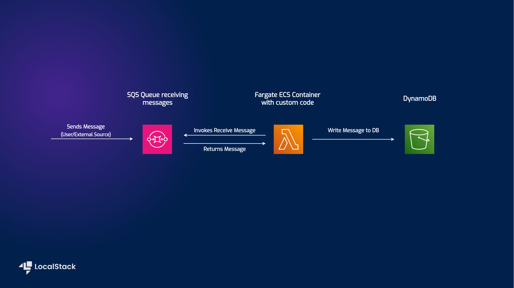

# LocalStack Fargate Messaging Processing application with AWS SQS, DynamoDB, and Fargate

| Key          | Value                                                                                 |
| ------------ | ------------------------------------------------------------------------------------- |
| Environment  |                                                                      |
| Services     | Step Functions, SQS, DynamoDB, FarGate                                                  |
| Integrations | CDK, AWS CLI                                                                            |
| Categories   | Serverless; Event-Driven architecture                                                   |
| Level        | Beginner                                                                                |
| GitHub       | [Repository link](https://github.com/baermat/sqs-fargate-ddb-cdk-go)                    |


## Introduction
This Messaging Processing application with AWS SQS, DynamoDB, and Fargate demonstates how to use the [AWS Fargate SQS DDB sample](https://github.com/aws-samples/sqs-fargate-ddb-cdk-go) on LocalStack.
It showcases how a fargate container can be deployed and configured to interact with other services, in this case SQS and DynamoDB.
The sample application implements the following integration among the various AWS services:
- User submits a message to the specified sqs-queue
- The Fargate container fetches any messages sent to the queue
- The Fargate container then writes any message fetched into the DynamoDB

Users can deploy this application on LocalStack using Cloud Development Kit (CDK)

## Architecture diagram

The following diagram shows the architecture that this sample application builds and deploys:



- [Fargate ECS](https://docs.localstack.cloud/tutorials/ecs-ecr-container-app/) to spawn a container to act as custom broker and relay any incoming messages.
- [SQS](https://docs.localstack.cloud/user-guide/aws/sqs/) to send messages to the application
- [DynamoDB](https://docs.localstack.cloud/user-guide/aws/dynamodb/) to persist the messages received.

## Prerequisites

- LocalStack Pro with the [`localstack` CLI](https://docs.localstack.cloud/getting-started/installation/#localstack-cli).
- [Cloud Development Kit](https://docs.localstack.cloud/user-guide/integrations/aws-cdk/) with the [`cdklocal`](https://www.npmjs.com/package/aws-cdk-local) installed.
- [AWS CLI](https://docs.localstack.cloud/user-guide/integrations/aws-cli/) with the [`awslocal` wrapper](https://docs.localstack.cloud/user-guide/integrations/aws-cli/#localstack-aws-cli-awslocal).
- [Node.js](https://nodejs.org/en/download)

## Instructions

You can build and deploy the sample application on LocalStack by running the `run.sh` script.
Here are instructions to deploy and test it manually step-by-step.

### Deploying the application

1. Navigate into the cloned repository.
2. Make sure the following environment variables are exported:
```
export LOCALSTACK_API_KEY=<your_api_key>
export SQS_QUEUE="sqs-fargate-queue"
export NETWORK_NAME="localstack-shared-net"
```
The `SQS_QUEUE` can be any AWS sqs conform queue name.
Likewise, `NETWORK_NAME` can be any name conforming to docker network naming conventions.
It is recommended to create a new network for this sample.

3. Create the docker network
```
docker network create $NETWORK_NAME
```
This network is required for the fargate ECS container to be able to [use LocalStack services](https://docs.localstack.cloud/references/network-troubleshooting/endpoint-url/#from-your-container).

4. Start LocalStack
```
LAMBDA_DOCKER_NETWORK=$NETWORK_NAME DOCKER_FLAGS="--network $NETWORK_NAME" DEBUG=1 localstack start -d
```
This starts LocalStack in detached mode with the necessary configurations.
If you prefer to be able to follow the debug output while deploying this sample, omit the `-d` flag, then open a new terminal window and navigate to the same location as before.

5. Build the Fargate container
```
docker build -t go-fargate .
```
This will build the container as specified in the Dockerfile.
Since the application code is written in go, it is tagged as `go-fargate`

6. Install the necessary dependencies for CDK
```
cd cdk
npm i
```
This will navigate into the correct folder and install all necessary packages

7. Bootstrap and Deploy the necessary resources
```
cdklocal bootstrap
cdklocal deploy
```
Deploys the needed infrastructure for this sample to work.
CDK will ask your permission; if you would rather skip the approval process, you can add the `--require-approval never` flag to the deploy command. 

8. (Optional) Assert that the SQS queue and the DynamoDB have been created
```
awslocal sqs list-queues
awslocal dynamodb list-tables
```
You can execute these commands to make sure that the infrastructure deployed as expected.
You should see output similar to the following:
```
{
    "QueueUrls": [
        "http://localhost:4566/000000000000/sqs-fargate-queue"
    ]
}
{
    "TableNames": [
        "sqs-fargate-ddb-table"
    ]
}
```
9. Send a message to the SQS queue
```
awslocal sqs send-message --queue $SQS_QUEUE --message-body '{"message": "hello world"}'
```
This sends a "hello world" message to the SQS queue, which is then processed by the Fargate container.
Wait a couple of seconds for the container to finish its task.

10. Check if the message was written to the database
```
awslocal dynamodb scan --table-name sqs-fargate-ddb-table
```
At this point, the message should have been written to the database.
You should see an answer similar to the following when executing the given command:
```
{
    "Items": [
        {
            "timestamp_utc": {
                "S": "2023-05-24T10:56:22.456Z"
            },
            "message": {
                "S": "hello world"
            },
            "id": {
                "S": "f00e46d3-414f-4170-b964-9a3d397111e4"
            }
        }
    ],
    "Count": 1,
    "ScannedCount": 1,
    "ConsumedCapacity": null
}
```

For the original repository, check [the original sample](https://github.com/aws-samples/sqs-fargate-ddb-cdk-go).