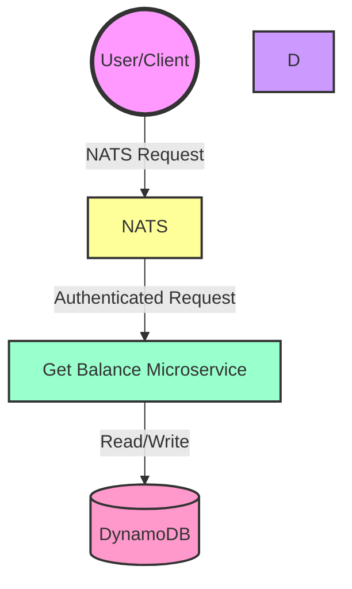

# Build and deploy message processing service using Fargate

This pattern demonstrates how to build and deploy Fargate service using Go which receives messages from SQS queue and stores it in DynamoDB table.

Important: this application uses various AWS services and there are costs associated with these services after the Free Tier usage - please see the [AWS Pricing page](https://aws.amazon.com/pricing/) for details. You are responsible for any AWS costs incurred. No warranty is implied in this example.

## Architecture

Here's a high-level overview of our serverless architecture:



### Component Breakdown

| Component | Purpose |
|-----------|---------|
| NATs | Handles NATS requests and routes them to the appropriate Microservice |
| Get Balance Microservice | Execute the business logic for balance retrieval and database seeding. Packages as a container, executes in Fargate (Serverless compute engine) |
| DynamoDB | Stores client balances in a scalable, low-latency NoSQL database |

This architecture allows for high scalability, low operational overhead, and pay-per-use pricing.

## Features

- ✨ Microservice architecture using AWS services, and NATS [services framework](https://docs.nats.io/using-nats/developer/services#service-operations)
- 💰 Balance retrieval for digital wallet accounts
- 🔒 JWT authentication for secure access
- 🚀 High-performance database seeding (1m records)

## Requirements

* [Use training AWS account]`aws sso login --profile training` Connects as `loyaltynz-techops-aws-training`
* [AWS CLI](https://docs.aws.amazon.com/cli/latest/userguide/install-cliv2.html) installed and configured with named AWS profile
* [Git](https://git-scm.com/book/en/v2/Getting-Started-Installing-Git) installed
* [AWS CDK](https://docs.aws.amazon.com/cdk/v2/guide/getting_started.html) installed
* [Go](https://go.dev/doc/install) installed
* [Docker](https://docs.docker.com/engine/install/) installed

## Deployment Instructions

1. Create a new directory, navigate to that directory in a terminal and clone the GitHub repository:
    ```
    git clone https://github.com/aws-samples/sqs-fargate-ddb-cdk-go.git
    ```
2. Change directory to the pattern directory:
    ```
    cd sqs-fargate-ddb-cdk-go
    ```

3. From the command line, use the following commands to deploy the stack using CDK:
    ```
    docker build -t go-fargate .
    cd cdk
    npm i
    export AWS_PROFILE=training
    cdk deploy
    ```

## How it works

In this pattern we created SQS queue, Fargate Service, and DynamoDB table.
Fargate service is receiving messages from SQS queue using long polling (20 seconds)
Once you send SQS message to the queue, Fargate service receives this message, processes it, and puts the message text into a new item of DynamoDB table.


## Testing

1. Open SQS console
2. Find SQS queue with name `sqs-fargate-queue`
3. Press `Send and Receive message` button
4. Enter the message into "Message Body" field, e.g.
```
{
    "message": "Hello, Fargate"
}
```


5. Press `Send message`
6. Open ECS console
7. Find cluster with name `go-service-cluster`
8. Find service named `go-fargate-service`
9. Open CloudWatch logs for an active task of this service and you'll see the messages from the service in the log.


10. Open DynamoDB console and find `sqs-fargate-ddb-table` table
11. Press `Explore table items` button and you'll see messages that Fargate service put into the table.


12. Check CloudWatch dashboard `go-service-dashboard` to monitor number of messages received from SQS and added into DynamoDB by the service.

## Cleanup

1. Delete the stack:
    ```
    export AWS_PROFILE=training
    cd cdk
    cdk destroy 
    ```
2. Confirm the stack has been deleted:
    ```
    aws cloudformation list-stacks --query "StackSummaries[?contains(StackName,'SqsFargate')].StackStatus" --profile ${AWS_PROFILE}
    ```


## License

This code is licensed under the MIT-0 License. See the LICENSE file.