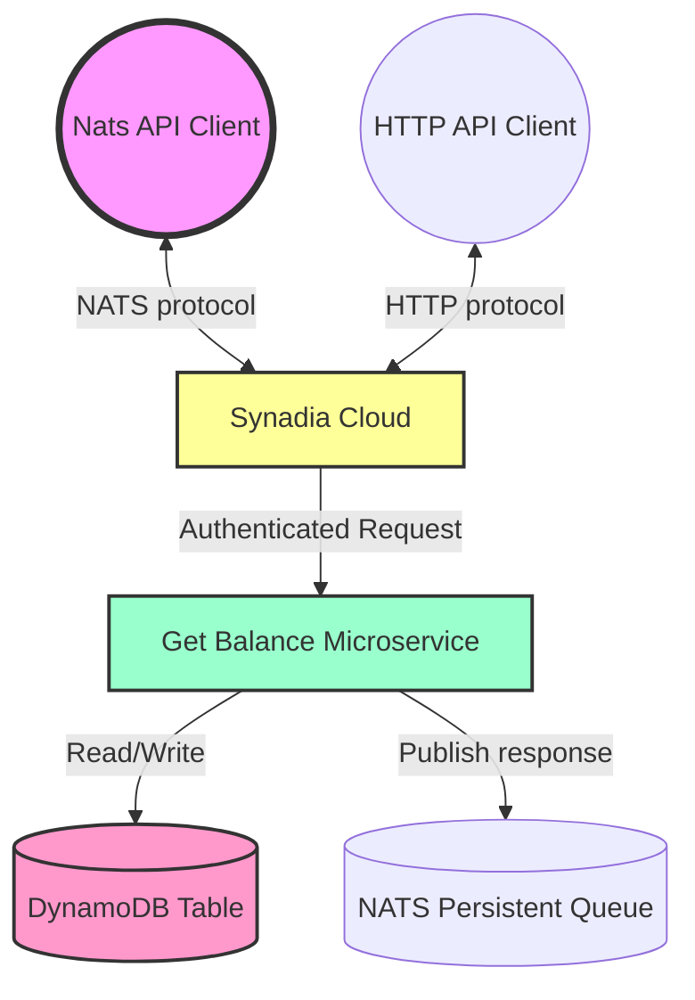

# Build and deploy message processing service using Fargate

This pattern demonstrates how to build and deploy Fargate service using Go which receives microservice messages from NATSs queries a DynamoDB table, and returns a response.


## Architecture

Here's a high-level overview of the architecture:



### Automated setup of NATS resources

For the purposes of the POC, the NATS resources (Account / User / KV bucket) were setup manually (see deployment steps below).

In a real system the LoyaltyHub control plane API would need to create these resources programatically. A small [application](control-plane/main.go) was created to verify that this is possible.  It uses the Synadia Cloud API following these [instructions](https://docs.synadia.com/cloud/faq#how-can-i-use-the-synadia-cloud-api) and using the [Control Plane Go SDK](https://github.com/synadia-io/control-plane-sdk-go) and a [Personal Access Token](https://cloud.synadia.com/profile/personal-access-tokens).

To run the application:

- Create a Personal access token, go to profile (top right) generate personal access token, and save it to a file `cdk/config/control-plane-agent.token`
- Run `make cp-create` to create a new Account `POC-DO`
- Run `make cp-delete` to delete Account `POC-DO`
- Run `make cp-list` to list Accounts

This code can be extended to also create the Users/ credentials / KV bucket etc that we created manually for the POC


### Component Breakdown

| Component | Purpose |
|-----------|---------|
| NATS API client | A client communicating via the NATS native protocol |
| HTTP API Client | A client communicating via HTTP eg: `curl` |
| Synadia Cloud | The managed NATs service. Handles NATS requests and routes them to the appropriate Microservice |
| Get Balance Microservice | Execute the business logic for balance retrieval and database seeding. Packaged as a container. Executes in Fargate (Serverless compute engine) |
| DynamoDB | Stores client balances in a scalable, low-latency NoSQL database |

This architecture allows for high scalability, low operational overhead, and pay-per-use pricing.

## Features

- ✨ Microservice architecture using AWS services, and NATS [services framework](https://docs.nats.io/using-nats/developer/services#service-operations)
- 💰 Simulate balance retrieval for digital wallet accounts
- 🔒 JWT authentication for secure access
- 🚀 High-performance database seeding (1k records)

## Requirements

* [Use training AWS account]`aws sso login --profile training` Connects as `loyaltynz-techops-aws-training`
* [AWS CLI](https://docs.aws.amazon.com/cli/latest/userguide/install-cliv2.html) installed and configured with named AWS profile
* [Git](https://git-scm.com/book/en/v2/Getting-Started-Installing-Git) installed
* [AWS CDK](https://docs.aws.amazon.com/cdk/v2/guide/getting_started.html) installed
* [Go](https://go.dev/doc/install) installed via `asdf install golang`
* [Docker](https://docs.docker.com/engine/install/) installed
* [Make] installed (`brew install make`)

## Deployment Instructions

1. Create a new directory, navigate to that directory in a terminal and clone the GitHub repository:

    `git clone https://github.com/aws-samples/nats-fargate-ddb-cdk-go.git`

2. Change directory to the pattern directory:

    `cd nats-fargate-ddb-cdk-go`

3. Turn off ZScaler 'Internet Security' otherwise the docker build wont work.


5. Manually create Synadia Account, Users, KV bucket & Stream

New Account: "POC"
New Users: `service` and `client`
Download credentials file for each user
New KV Bucket `config`
New Stream: 
    name: `customer-balances` 
    Storage: `file`
    subject: `customer.balance.>`
    retention > discard policy: `old`
    Max age: `7 days`
    Max bytes: `10Mb`
    Replicas: `3`


6. Extract credentials for deployment via CDK
    
    `cp ~/Downloads/NGS-poc-service.creds nats-fargate-ddb-cdk-go/cdk/config/NGS-poc-service.creds`


  Install credentials in the `nats` tool so can use that to interact with the service:

    nats context save \
        --select "NGS-poc-service" \
        --server "tls://connect.ngs.global" \
        --creds ~/.ngs-poc/NGS-poc-service.creds

    nats context save \
        --select "NGS-poc-client" \
        --server "tls://connect.ngs.global" \
        --creds ~/.ngs-poc/NGS-poc-client.creds


7. From the command line, use the following commands to deploy the stack using CDK:

```bash
export AWS_PROFILE=training

aws sso login

# Check connected to training account by running this
aws s3 ls

# Deploy the code
make deploy
```

If you see the error `fail: unable to get local issuer certificate`, turn off internet security in ZScaler and retry.


## How it works

The service is packaged as a single binary, running in a docker container.

The container runs inside _Elastic Container Service_, as a single `Service` (aka Kubernetes Deployment), that run a single `Task` (aka Kubernetes pod)

When the service runs, it establishes a connection with NATS, and also with DynamoDB.  It then listens for requests. As a request comes in it decodes the JSON payload to extract the `customer_id`, it queries the database retrieving the row with a matching `id` column, and returning the `client_balance` value.  The response is encoded back into JSON and returned. 

### Service configuration

Using the CDK we upload the `NGS-poc-service.creds` credentials to _AWS Secrets Manager_ as `{user-initials}/NATSCreds` for posterity (not strictly required). The CDK scripts encode the credentials in [base64](https://en.wikipedia.org/wiki/Base64) and puts the value into the `NATS_CREDENTIALS` environment variable.  When the service starts up, it extracts the credentials, decodes them and uses them to connect to NATS as the `service` User.

Each instance of the app gets a unique _DynamoDB_ table name, so we pass that in an environment variable `DDB_TABLE`. Access to read and write to _DynamoDB_ tables is granted to `Task`

### Database seeding

When the application first starts, after it connects to NATS it looks for a KV value `seed`. If it exists then it recognises that the database has been seeded. Otherwise it inserts `1000` random rows into _DynamoDB_ and sets the `seed` value to `done`


## Testing

To call the service using the NATS client, you can use the `nats` cli tool, eg:

First I select the default nats context, so that I will connect as the `client`:

```
$ nats context select NGS-poc-client
NATS Configuration Context "NGS-poc-client"

  Server URLs: tls://connect.ngs.global
  Credentials: /Users/DavidOram/.ngs-poc/NGS-poc-client.creds (OK)
         Path: /Users/DavidOram/.config/nats/context/NGS-poc-client.json
```

Verify that as follows:

```
$ nats context ls
╭───────────────────────────────╮
│         Known Contexts        │
├─────────────────┬─────────────┤
│ Name            │ Description │
├─────────────────┼─────────────┤
│ NGS-Default-CLI │             │
│ NGS-poc-client* │             │
│ NGS-poc-service │             │
╰─────────────────┴─────────────╯
```


```
nats req customer.balance '{ "client_id": "678" }'                       
08:18:12 Sending request on "customer.balance"
08:18:12 Received with rtt 66.45625ms
{"balance":7120}
```


To call the service using an HTTP client, you would go to the Synadia Cloud UI, and get an access token for the `client` User, then inject that where it says `{token}` below.

```
curl -X POST "https://api.ngs.global/v1/nats/subjects/customer.balance" \
 -H "accept: text/plain"\      
 -H "authorization: {token}"\
 -H "content-type: application/json" \
 -d '{"client_id":"678"}' 

{"balance":7120}                                              
```

To run a simple benchmark run `go run benchmark`

Here I run it with increasing the requests from 1000, 10,000 and then 100,00 API calls (See `./benchmark.go`):

```
➜  nats-fargate-ddb-cdk-go git:(dapr-13-synadia-integration) ✗ go run benchmark.go
2024/07/17 10:21:42 Sending requests to the service...
2024/07/17 10:21:44 Total of 1000 requests, with max concurrency 1000, and request timeout 5s, completed in 2.050677375s. Average call took 2.05 milliseconds
➜  nats-fargate-ddb-cdk-go git:(dapr-13-synadia-integration) ✗ go run benchmark.go
2024/07/17 10:22:08 Sending requests to the service...
2024/07/17 10:22:28 Total of 10000 requests, with max concurrency 1000, and request timeout 5s, completed in 20.624851125s. Average call took 2.06 milliseconds
➜  nats-fargate-ddb-cdk-go git:(dapr-13-synadia-integration) ✗ go run benchmark.go
2024/07/17 10:22:38 Sending requests to the service...
2024/07/17 10:26:53 Total of 100000 requests, with max concurrency 1000, and request timeout 5s, completed in 4m14.820910542s. Average call took 2.55 milliseconds
```
.. after changing from 1 ECS Task to 3 Tasks, the performance changed:

```
➜  nats-fargate-ddb-cdk-go git:(feature/scale-to-3) ✗ go run benchmark.go
2024/07/18 11:08:34 Sending requests to the service...
2024/07/18 11:10:08 Total of 100000 requests, with max concurrency 1000, and request timeout 5s, completed in 1m33.970400417s. Average call took 0.94 milliseconds
```


To see the [stats](https://github.com/nats-io/nats-architecture-and-design/blob/main/adr/ADR-32.md#stats), note that the times are reported in nano-seconds:

    nats req '$SRV.STATS.customer' '' | jq .
    11:03:38 Sending request on "$SRV.STATS.customer"
    11:03:38 Received with rtt 47.707667ms
    {
    "name": "customer",
    "id": "lkx5dEutUcH1jWMjbyXu4D",
    "version": "0.0.1",
    "metadata": {},
    "type": "io.nats.micro.v1.stats_response",
    "started": "2024-07-16T02:51:25.785027925Z",
    "endpoints": [
        {
        "name": "balance",
        "subject": "customer.balance",
        "queue_group": "q",
        "num_requests": 223029,
        "num_errors": 1000,
        "last_error": "403:BAD_REQUEST",
        "processing_time": 537595333587,
        "average_processing_time": 2410427
        }
    ]
    }

## Cleanup

1. To delete the artifacts

   ``` make destroy```


2. Delete the KV value `seed` in the `config` bucket. If you don't do that then the next time the system is re-created, it wont load any seed data into the database.


