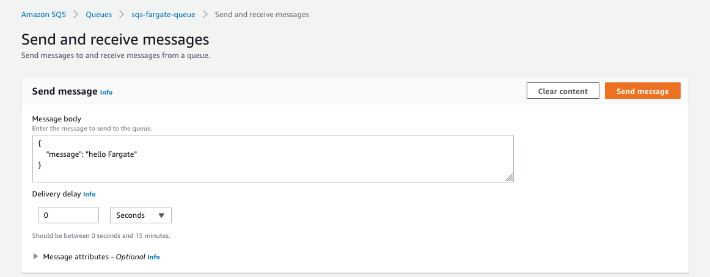
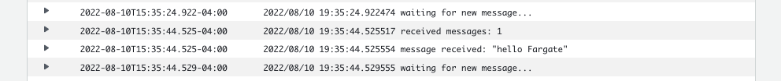
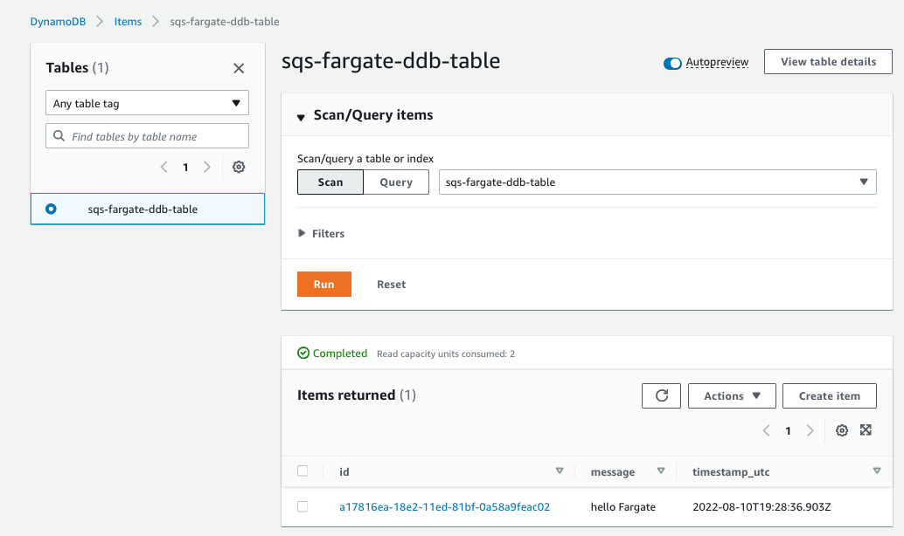

# SQS to Fargate to DynamoDB Pattern

This pattern demonstrates how to build and deploy Fargate service using Go which receives messages from SQS queue and stores it in DynamoDB table.

Important: this application uses various AWS services and there are costs associated with these services after the Free Tier usage - please see the [AWS Pricing page](https://aws.amazon.com/pricing/) for details. You are responsible for any AWS costs incurred. No warranty is implied in this example.

## Requirements

* [Create an AWS account](https://portal.aws.amazon.com/gp/aws/developer/registration/index.html) if you do not already have one and log in. The IAM user that you use must have sufficient permissions to make necessary AWS service calls and manage AWS resources.
* [AWS CLI](https://docs.aws.amazon.com/cli/latest/userguide/install-cliv2.html) installed and configured
* [Git](https://git-scm.com/book/en/v2/Getting-Started-Installing-Git) installed
* [AWS CDK](https://docs.aws.amazon.com/cdk/v2/guide/getting_started.html) installed
* [Go](https://go.dev/doc/install) installed
* [Docker](https://docs.docker.com/engine/install/) installed

## Deployment Instructions

1. Create a new directory, navigate to that directory in a terminal and clone the GitHub repository:
    ```
    git clone https://github.com/aws-samples/sqs-fargate-ddb-cdk-go.git
    ```
1. Change directory to the pattern directory:
    ```
    cd sqs-fargate-ddb-cdk-go
    ```
1. From the command line, use the following command to deploy the stack using CDK:
    ```
    make deploy
    ```

## How it works

In this pattern we created SQS queue, Fargate Service, and DynamoDB table.
Fargate service is receiving messages from SQS queue using long polling (20 seconds)
Once you send SQS message to the queue, Fargate service receives this message, parses it, and puts message text into a new item of DynamoDB table.


## Testing

1. Open SQS console
2. Find SQS queue with name `sqs-fargate-queue`
3. Press `Send and Receive message` button
4. Enter the message into "Message Body" field, e.g.
```
{
    "message": "Hello, Fargate"
}
```



5. Press `Send message`
6. Open ECS console
7. Find cluster with name `go-service-cluster`
8. Find service named `go-fargate-service`
9. Open CloudWatch logs for active task of this service and you'll messages from the service in the log.



10. Open DynamoDB console and find `sqs-fargate-ddb-table` table
11. Press `Explore table items` button and you'll see messages that Fargate service put into the table.



## Cleanup

1. Delete the stack
    ```
    make destroy
    ```
2. Confirm the stack has been deleted
    ```
    aws cloudformation list-stacks --query "StackSummaries[?contains(StackName,'SqsFargate')].StackStatus"
    ```


## License

This code is licensed under the MIT-0 License. See the LICENSE file.