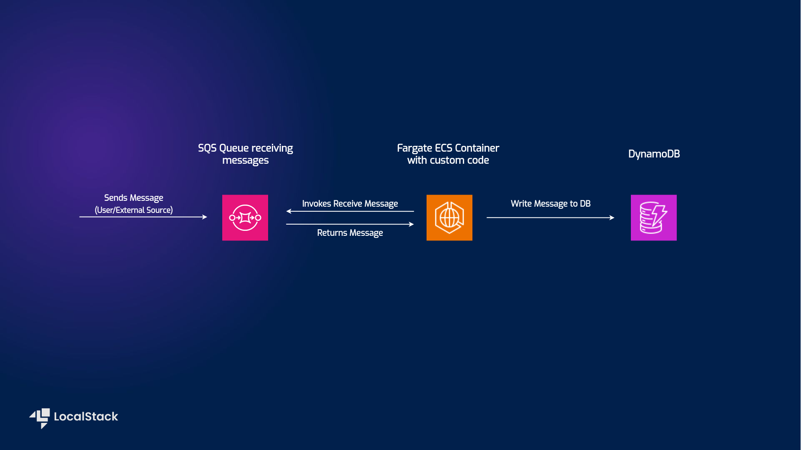

# Messaging Processing application with SQS, DynamoDB, and Fargate

| Key          | Value                                                                                 |
| ------------ | ------------------------------------------------------------------------------------- |
| Environment  |                                                                       |
| Services     | Step Functions, SQS, DynamoDB, Fargate                                                  |
| Integrations | CDK, AWS CLI                                                                            |
| Categories   | Serverless; Event-Driven architecture                                                   |
| Level        | Beginner                                                                                |
| GitHub       | [Repository link](https://github.com/localstack/sqs-fargate-ddb-cdk-go)                 |


## Introduction

The Messaging Processing application demonstrates how to deploy and configure a Fargate container to interact with other services, specifically SQS and DynamoDB. The sample application implements the following integration among the various AWS services:

- User submits a message to the specified SQS queue.
- The Fargate container fetches any messages sent to the queue.
- The Fargate container then writes any fetched messages into DynamoDB.

Users can deploy this application sample on AWS & LocalStack using Cloud Development Kit (CDK) with minimal changes. To test this application sample, we will demonstrate how you use LocalStack to deploy the infrastructure on your developer machine and your CI environment.

## Architecture diagram

The following diagram shows the architecture that this sample application builds and deploys:



- [Fargate ECS](https://docs.localstack.cloud/tutorials/ecs-ecr-container-app/) to spawn a container to act as a custom broker and relay any incoming messages.
- [SQS](https://docs.localstack.cloud/user-guide/aws/sqs/) to send messages to the application using long polling (20 seconds).
- [DynamoDB](https://docs.localstack.cloud/user-guide/aws/dynamodb/) to persist the messages received after being processed by the Fargate service.

## Prerequisites

- LocalStack Pro with the [`localstack` CLI](https://docs.localstack.cloud/getting-started/installation/#localstack-cli).
- [Cloud Development Kit](https://docs.localstack.cloud/user-guide/integrations/aws-cdk/) with the [`cdklocal`](https://www.npmjs.com/package/aws-cdk-local) installed.
- [AWS CLI](https://docs.localstack.cloud/user-guide/integrations/aws-cli/) with the [`awslocal` wrapper](https://docs.localstack.cloud/user-guide/integrations/aws-cli/#localstack-aws-cli-awslocal).
- [Node.js](https://nodejs.org/en/download)

## Instructions

You can build and deploy the sample application on LocalStack by running `make run`.
Here are instructions to deploy and test it manually step-by-step.

### Running the LocalStack container

Before starting the LocalStack container, configure the following environment variables which act as configurations for the LocalStack container:

```bash
export LOCALSTACK_API_KEY=<your_api_key>
export SQS_QUEUE="sqs-fargate-queue"
export NETWORK_NAME="localstack-shared-net"
```

The `SQS_QUEUE` and `NETWORK_NAME` can be any name that confirms to the naming conventions of SQS and Docker networks respectively.

To create a Docker network, run the following command:

```bash
docker network create $NETWORK_NAME
```

This network is required for the Fargate ECS container to be able to [use LocalStack services from the running Docker container](https://docs.localstack.cloud/references/network-troubleshooting/endpoint-url/#from-your-container).

Run the following command to start the LocalStack container:

```bash
LAMBDA_DOCKER_NETWORK=$NETWORK_NAME DOCKER_FLAGS="--network $NETWORK_NAME" DEBUG=1 localstack start -d
```

This starts LocalStack in detached mode with the necessary configurations.
> If you prefer to be able to follow the debug output while deploying this sample, omit the `-d` flag, then open a new terminal window and navigate to the same location as before.

### Build the infrastructure

After running the LocalStack container, you can build the Fargate Docker image:

```bash
docker build -t go-fargate .
```

As specified in the [`Dockerfile](./Dockerfile), this builds the Docker image with the name `go-fargate`. You can now install the necessary dependencies for CDK and deploy the infrastructure. Run the following command:

```bash
cd cdk
npm i
```

This will navigate into the correct folder and install all necessary packages

### Deploy the infrastructure

To deploy the sample application, we will use CDK to bootstrap the environment and deploy the infrastructure. Run the following commands:

```bash
cdklocal bootstrap
cdklocal deploy
```

> While deploying the infrastructure, CDK will ask your permission — If you would rather skip the approval process, you can add the `--require-approval never` flag to the deploy command. 

### Testing the application

To assert that the SQS queue and the DynamoDB have been created, run the following commands:

```bash
awslocal sqs list-queues
awslocal dynamodb list-tables
```

You should see output similar to the following:
```
{
    "QueueUrls": [
        "http://localhost:4566/000000000000/sqs-fargate-queue"
    ]
}
{
    "TableNames": [
        "sqs-fargate-ddb-table"
    ]
}
```

Next, send a message to the SQS queue. Run the following command:

```bash
awslocal sqs send-message --queue $SQS_QUEUE --message-body '{"message": "hello world"}'
```

This sends a `hello world` message to the SQS queue, which is then processed by the Fargate container. You can wait for a couple of seconds for the container to finish its task.

To check if the message has been written to the DynamoDB table, run the following command:

```bash
awslocal dynamodb scan --table-name sqs-fargate-ddb-table
```

You should see an answer similar to the following when executing the given command:

```bash
{
    "Items": [
        {
            "timestamp_utc": {
                "S": "2023-05-24T10:56:22.456Z"
            },
            "message": {
                "S": "hello world"
            },
            "id": {
                "S": "f00e46d3-414f-4170-b964-9a3d397111e4"
            }
        }
    ],
    "Count": 1,
    "ScannedCount": 1,
    "ConsumedCapacity": null
}
```

To run this sample against AWS, check [the original repository](https://github.com/aws-samples/sqs-fargate-ddb-cdk-go).

## Learn more

The sample application is based on a [public AWS sample app](https://github.com/aws-samples/sqs-fargate-ddb-cdk-go) that deploys a message processing service using Fargate. See this AWS patterns post for more details: [Run message-driven workloads at scale by using AWS Fargate](https://docs.aws.amazon.com/prescriptive-guidance/latest/patterns/run-message-driven-workloads-at-scale-by-using-aws-fargate.html).

## Contributing

We appreciate your interest in contributing to our project and are always looking for new ways to improve the developer experience. We welcome feedback, bug reports, and even feature ideas from the community.
Please refer to the [contributing file](CONTRIBUTING.md) for more details on how to get started. 
